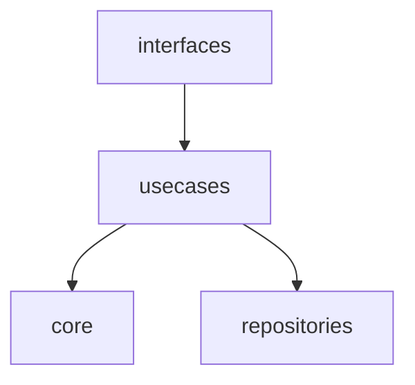

# 開発原則

## アーキテクチャ概要

### 基本構成

```plain
├── index.ts                   # アプリケーションエントリーポイント（各層のファクトリー関数を組み立て）
├── interfaces/                # 命令型シェル（外界との境界）
│   ├── http/                  # HTTP API（routes.ts, handlers.ts）
│   ├── cli/                   # CLI
│   └── events/                # イベント処理
├── usecases/                  # ドメインロジック（フロー管理）
│   ├── core/                  # このアプリ固有のドメインロジック（純粋関数）
│   │   ├── xxx.ts
│   │   ├── yyy.ts
│   │   └── zzz.ts
│   ├── users/                 # ユーザー関連ユースケース
│   │   ├── dependencies.ts    # ユーザー関連依存関係定義
│   │   └── userUseCases.ts    # ユーザー機能実装
│   └── tasks/                 # タスク関連ユースケース
│       ├── dependencies.ts    # タスク関連依存関係定義
│       └── taskUseCases.ts    # タスク機能実装
└── externals/                 # 命令型シェル（副作用）
    ├── postgres/              # DB操作
    │   ├── functions/         # 純粋関数
    │   └── index.ts
    ├── openai-compatible-api/ # 外部API
    │   ├── functions/         # 純粋関数
    │   └── index.ts
    └── filesystem/            # ファイル操作
        ├── functions/         # 純粋関数
        └── index.ts

```

- 上記のファイルとフォルダは参考。実際の要件や仕様に合わせる。

### 命名規則

#### TypeScript/JavaScript 標準準拠

```typescript
// ✅ 正しい命名パターン
// 1. lowerCamelCase: 変数、関数、プロパティ
const userName = "sample";
const processWorkflow = async () => {};
const apiResponse = await fetch();

// 2. PascalCase: 型、インターフェース、クラス
interface WorkflowInput { prompt: string; }
interface WorkflowOutput { response: string; }
class AgentExternal {}
type MCPServerConfig = {};
```

#### アーキテクチャ層対応サフィックス

各層の責務を明確化するため、以下のサフィックスパターンを使用：

```typescript
// External パターン - データアクセス層
export interface WorkflowExternal {}
export const createMCPExternal = () => {};

// UseCases パターン - ビジネスロジック層  
export const workflowUseCases = {};

// Handler パターン - インターフェース層
export const workflowHandler = async () => {};

// Config パターン - 設定定義
const workflowMCPConfig: MCPServerConfig = {};

// Schema パターン - バリデーション定義（型定義と同様の性質のためPascalCase）
export const WorkflowInputSchema = z.object({});
export const ValidationRuleSchema = z.object({});

// Input/Output パターン - データ転送オブジェクト
interface WorkflowInput {}
interface ToolSelectionOutput {}
```

#### ファイル命名規則

```plain
- ファイル名: lowerCamelCase
  ✅ workflowUseCases.ts
  ✅ agentExternal.ts
  ❌ WorkflowUseCases.ts

- ディレクトリ名: lowerCamelCase
  ✅ usecases/workflow/
  ❌ UseCases/Workflow/
```

#### 一貫性チェックリスト

- [ ] 型・インターフェースはPascalCaseか？
- [ ] 変数・関数はlowerCamelCaseか？
- [ ] External/UseCases/Handler等のサフィックスが適切か？
- [ ] ファイル名・ディレクトリ名はlowerCamelCaseか？

### 依存関係の向き



### 純粋関数の優先原則

interfaces層であっても、repositories層であっても、純粋関数で書ける処理は純粋関数で書く:

- 副作用が必要ない処理は純粋関数として実装
- 層の決定は責任・機能で行い、実装では可能な限り純粋関数を使用
- テスト容易性を最大化

## 5つの必須ルール

### ルール1: 層ごとの責任分離

#### core層: アプリ固有ドメインロジック（純粋関数のみ）

- 同じ入力には同じ出力
- 副作用禁止（`fetch`、`db.query`、ファイルアクセス等は使用不可）
- バリデーション、データ変換、計算処理を担当

#### usecases層: ドメインフロー管理

- coreの純粋関数を組み合わせ
- repositoriesの副作用を実行
- ドメインロジック全体の流れを管理
- interfaces層から呼び出される唯一の窓口

なぜこのルール？

- core層: テストが簡単、バグが起きにくい、並行処理で安全、理解しやすい
- usecases層: フローの明確化

```typescript
// ✅ 良い例: core層（純粋関数）
export const validateUserData = (input: CreateUserInput): ValidationResult => {
  if (!input.email || !input.email.includes('@')) {
    return { isValid: false, error: 'Invalid email' };
  }
  return { isValid: true };
};

// ✅ 良い例: usecases層（フロー管理）
export const createUserUseCase = async (
  input: CreateUserInput, 
  deps: { userExternal: UserExternal }
): Promise<User> => {
  // 1. 純粋関数でバリデーション
  const validation = validateUserData(input);
  if (!validation.isValid) throw new ValidationError(validation.error);
  
  // 2. 純粋関数でデータ変換
  const userData = transformToUserEntity(validation.data);
  
  // 3. 副作用でデータ保存
  return await deps.userExternal.save(userData);
};

// ❌ 悪い例: core層で副作用
export const createUserLogic = async (userRepo: UserExternal) => {
  // core層で副作用は禁止
};
```

### ルール2: usecasesのみがcoreを呼ぶ

- coreは他の層を参照しない
- core層のインターフェースは、usecases層や、repositories層、interfaces層に依存しない
- usecasesのみがcoreの純粋関数を利用する
- interfacesやexternalsはcoreを直接利用しない
- interfacesやexternals内のfunctionsフォルダで純粋関数を実装する場合、それは各層固有（依存）の処理でありcore（ドメインロジック）ではない

なぜこのルール？

- 変更に強い：coreのロジックは外部の変更に影響されない
- テストが独立：coreのテストで外部サービスを考慮する必要がない
- 責任が明確：ドメインロジックと外部アクセスが分離される
- 再利用しやすい：HTTPでもCLIでも同じcoreロジックを使える

```typescript
// ✅ 良い例：usecases層
import { validateUserData } from '../../core/logic/userLogic'; // OK

// ❌ 悪い例：core層
import { UserExternal } from '../../repositories/database/userExternal'; // NG
```

### ルール3: 依存の向きは一方向のみ

- interfaces → usecasesの向きを厳守
- usecases → coreの向きを厳守
- usecases → repositories（DI注入のみ）
- 循環依存禁止

なぜこのルール？

- 理解しやすい：データの流れが一方向で追いやすい
- ビルドが安定：循環依存によるビルドエラーを防ぐ
- 変更影響が予測可能：どこを変更すると何に影響するかが明確
- リファクタリングが安全：依存関係が複雑に絡まない

### ルール4: ドメインごとの依存関係管理

- 各ドメインで必要な依存関係のみ定義
- /index.tsはinterfaces層の初期化や起動のみ担当
- usecases層で依存関係の組み立てを実行
- Factory Function パターン採用

なぜこのルール？

- 関心事の分離：各ドメインが独立して開発可能
- 認知負荷の軽減：実装者は担当領域の依存関係のみ理解
- テスト容易性：必要最小限の依存関係でテスト可能
- 変更影響の局所化：他ドメインへの影響なし
- /index.tsの責任明確化：interfaces層の初期化や起動のみに専念

```typescript
// usecases/user/dependencies.ts
export type UserDependencies = {
  userExternal: UserExternal;
  emailService: EmailService;
};

// /index.ts - 共有インフラストラクチャのみ作成・公開
const db = createDatabase(process.env.DATABASE_URL);
export const userExternal = createUserExternal(db);
export const emailService = createEmailService();

// usecases/user/userUseCases.ts - usecases層でDI実行
import { userExternal, emailService } from '../../main';

export const createUserUseCases = (deps: UserDependencies) => ({
  createUser: async (input: CreateUserInput) => {
    const validation = validateUserData(input); // core層
    return await deps.userExternal.save(validation.data);
  },
  
  getUserById: async (id: string) => {
    return await deps.userExternal.findById(id);
  },
});

// usecases層で実際にDIを実行
export const userUseCases = createUserUseCases({
  userExternal,
  emailService,
});
```

```typescript
// interfaces層
import { userUseCases } from '../usecases/user/userUseCases';

export const createUserHandler = async (req: Request) => {
  const result = await userUseCases.createUser(req.body);
  return { status: 201, body: result };
};
```

### ルール5: 型でDI対象を明示

- 依存関係を型で明確に定義
- `any`型の使用禁止

なぜこのルール？

- 属人化防止：何に依存しているかが型で明確になる
- コンパイル時チェック：依存関係の不整合を実行前に発見
- IDEサポート：自動補完やリファクタリングが正確に動作
- ドキュメント効果：型定義が仕様書の役割を果たす

```typescript
// ✅ 良い例: ドメインごとの依存関係型定義
// usecases/user/dependencies.ts
export type UserDependencies = {
  userExternal: UserExternal;
  emailService: EmailService;
};

// usecases/payment/dependencies.ts
export type PaymentDependencies = {
  paymentGateway: PaymentGateway;
  userExternal: UserExternal; // 必要に応じて共有
};

export const createUserUseCases = (deps: UserDependencies) => ({
  // 型により依存関係が明確
});
```

## DI境界の属人化防止ルール

### データアクセス境界ルール

1. SQLはrepositories層のみ
    - core層にSQL禁止
    - usecases層にSQL禁止
    - interfaces層にSQL禁止
    - 理由：データベース変更時の修正箇所を局所化
    - ただし、SQL にドメインロジックを持ち込まないこと
2. データベース切り替え可能性を考慮
    - repositories層のインターフェースはDB固有機能に依存しない
    - 理由：将来的なDB変更に対応可能
3. 外部API呼び出しはrepositories層のみ
    - HTTPクライアントの設定はrepositories層
    - レスポンス形式の変換もrepositories層で実施
    - 理由：外部サービス変更時の影響を局所化
4. データベースに限らず、クライントライブラリの入れ替えを考慮
    - クライアントライブラリのルールが、usecases層にあると、入れ替えが困難
    - クライアントライブラリ入れ替えのような変更にも強くする
    - クライアントを実際に入れ替えることが無いとしても責任の分離を行う
5. 環境依存処理の分離
    - 環境変数の読み取りは`/index.ts`のみ
    - 設定オブジェクトとして各層に注入
    - 理由：環境設定変更時の修正箇所を明確化

## バリデーションと認証の配置

### バリデーション分類

1. インターフェースのプロトコル依存バリデーション → `interfaces層`
   - 通信プロトコル（HTTP等）に依存するバリデーション
   - 外部システム制約に依存するバリデーション
2. ドメインロジック依存バリデーション → `core層`（純粋関数として）
   - ドメインロジックに依存するバリデーション

### 認証・認可配置

1. 基本認証・ロール認可 → ミドルウェアで処理
2. リソース固有認可 → `interfaces層`で処理

## HTTP層の構成

### シンプルな構成

```plain
interfaces/http/
├── routes.ts       # ルーティング定義（ハンドラー呼び出し）
├── handlers/       # 機能別ハンドラー
└── middleware/     # 認証・CORS・レート制限等
```

## コードレビューチェックリスト

### 必須確認事項

1. [ ] coreに副作用はないか？（`fetch`、`db.query`等）
2. [ ] usecasesでドメインフローが適切に管理されているか？
3. [ ] 依存の向きは正しいか？（coreが他層をimportしていないか）
4. [ ] 各ドメインの依存関係が適切に分離されているか？
5. [ ] Factory Functionパターンが正しく実装されているか？
6. [ ] 型で依存関係が明示されているか？（`any`使用していないか）
7. [ ] core の関数は純粋か？（同じ入力で異なる出力の可能性はないか）
8. [ ] ドメイン間の循環依存がないか？
9. [ ] テストで必要最小限の依存関係のみモック化されているか？
10. [ ] 機能独立性が確保されているか？（他機能の影響を受けない）
11. [ ] 「かもしれない」で設計判断していないか？（現在の要件のみ）
12. [ ] 設定は機能内で管理されているか？（/index.tsに集約していない）
13. [ ] /index.tsはinterfaces層の初期化や起動のみか？（usecases層の責任を持っていない）

## 関心事分離とドメイン独立性

### 実装者の作業範囲

ユーザー機能開発者:

- `usecases/user/` ディレクトリのみ担当
- ユーザー関連の依存関係のみ理解
- 他のドメインを知る必要なし

決済機能開発者:

- `usecases/payment/` ディレクトリのみ担当  
- 決済関連の依存関係のみ理解
- 他のドメインを知る必要なし

### テストの簡素化

```typescript
// tests/user/createUser.test.ts
import { createUserUseCases } from '../../usecases/user/userUseCases';

describe('User UseCases', () => {
  it('should create user', async () => {
    const userUseCases = createUserUseCases({
      userExternal: mockUserExternal, // ユーザー関連のモックのみ
      emailService: mockEmailService,
    });
    
    const result = await userUseCases.createUser(validInput);
    expect(result).toEqual(expectedUser);
  });
});
```

### この設計の利点

1. 関心事の完全分離: ドメインごとに独立
2. 認知負荷の軽減: 実装者は担当領域のみ理解
3. 独立開発: チーム分けが自然
4. テスト容易性: 必要最小限の依存関係
5. 変更影響の局所化: 他ドメインへの影響なし

### ドメイン間連携が必要と考えた場合

基本方針: 既存のusecasesを呼び合うのではなく、新しい独立したユースケースを作成

理由:

- 既存ユースケース間の依存関係が複雑化するため
- 各ドメインの独立性を保つため
- 処理が違うなら、内部に共通点があっても独立したユースケースとして実装

```typescript
// ❌ 悪い例: 複数ドメインを組み合わせるユースケース
const createUserWithNotifications = async (input: CreateUserInput) => {
  const user = await userUseCases.createUser(input);
  await notificationUseCases.sendWelcomeEmail(user);
  await paymentUseCases.initializeWallet(user.id);
  return user;
};
```

### 共有ロジックの管理

- 重要な共通ロジック: `core層`に配置
- ユーティリティ関数: `utilities層`を新設（必要に応じて）
- 似た処理の重複: 独立性を優先し、重複を許容

## 機能独立性の原則（Function Independence Principle）

### 基本方針

各エンドポイント・機能は完全に独立して動作すること：

- 設定、依存関係、初期化処理を機能内で完結
- 他機能の影響を受けず、他機能に影響を与えない
- /index.tsはinterfaces層の初期化や起動のみ

### なぜこの原則？

1. 変更容易性: 一機能の変更が他に波及しない
2. 障害影響の局所化: 一機能の不具合でアプリ全体が停止しない  
3. 並行開発の促進: 開発者は担当機能のみに集中可能
4. テスト容易性: 機能単位での独立したテスト実行

### 実装例

```typescript
// ❌ 悪い例: /index.tsで共有設定
// /index.ts
export const mcpConfig = { /* 共有設定 */ };

// ✅ 良い例: 機能内で専用設定
// usecases/workflow/workflowUseCases.ts
const workflowMCPConfig = { /* workflow専用設定 */ };
```

### 判断基準

共有すべきか迷ったら → 独立を選択:

- 「将来他機能で使うかも」→ 使わない前提で設計
- 「同じライブラリだから」→ 設定が異なる可能性を考慮
- 「重複が発生する」→ 独立性を優先、重複は許容

## Factory Function パターンの徹底

### 基本方針

すべてのExternal作成はFactory Functionで統一：

```typescript
// ✅ 統一パターン
export const createMCPExternal = (config: MCPConfig) => { /* */ };
export const createAgentExternal = () => { /* */ };
export const createStepExternal = () => { /* */ };
```

### なぜFactory Function？

1. 依存関係の明示: 何が必要かがシグネチャで明確
2. テスタビリティ: モック注入が容易
3. 型安全性: TypeScriptによる引数チェック
4. 複数インスタンス: 異なる設定での作成可能
5. 一貫性: チーム開発での迷いを排除

### 判断基準

インスタンス vs Factory Function:

- インスタンス：状態を持たない、設定不要 → Factory Functionを選択
- 理由：将来の拡張性、テスト容易性を考慮

```typescript
// ❌ 避ける: インスタンス直接export
export const agentExternal = createAgentExternal();

// ✅ 推奨: Factory Function export
export const createAgentExternal = () => new AgentExternal();
```

## 予測駆動設計の禁止

### 基本方針

現在の明確な要件のみに基づいて設計する：

- 「将来○○するかもしれない」で設計判断しない
- 不確実な未来のために現在の独立性を犠牲にしない
- 要件が明確になった時点で適切にリファクタリング

### なぜこの原則？

1. 過剰設計の防止: 使われない抽象化の排除
2. 認知負荷の軽減: 開発者は現在の要件のみ理解
3. 変更容易性: シンプルな構造ほど変更が容易
4. YAGNI原則: "You Aren't Gonna Need It"の徹底

### 実装例

```typescript
// ❌ 悪い例: 予測による共有化
// 「認証機能でもMCPを使うかも」で共有設計
export const sharedMCPConfig = { /* */ };

// ✅ 良い例: 現在の要件のみ
// workflow機能のみ実装中なので、workflow専用
const workflowMCPConfig = { /* workflow専用 */ };
```

### 判断基準チェックリスト

- [ ] 「かもしれない」「将来的に」が判断根拠に含まれていないか？
- [ ] 現在使用していない抽象化・共通化を作っていないか？
- [ ] 「今必要な最小限の実装」になっているか？

## 設定の分散管理

### 基本方針

設定は機能ごとに分散管理する：

- 共有設定ファイルではなく、機能内設定
- 環境変数も機能内で読み取り
- /index.tsに設定を集約しない

### なぜ分散管理？

1. 変更影響の局所化: 設定変更が他機能に影響しない
2. 独立デプロイ: 機能単位での設定変更・デプロイ可能
3. 責任の明確化: 設定の管理責任が明確
4. テスト容易性: 機能単位でのテスト用設定注入

### 実装例

```typescript
// ❌ 悪い例: /index.tsで集約
// /index.ts  
export const appConfig = {
  workflow: { mcpServer: "..." },
  task: { jwtSecret: "..." }
};

// ✅ 良い例: 機能内管理
// usecases/workflow/workflowUseCases.ts
const workflowConfig = {
  mcpServer: process.env.WORKFLOW_MCP_SERVER || "default"
};

// usecases/task/taskUseCases.ts  
const taskConfig = {
  jwtSecret: process.env.TASK_JWT_SECRET || "default"
};
```

## 新メンバー向け理解指針

この構成の理解は簡単：

1. core = ドメインロジックの計算だけ（純粋関数のみ）
2. usecases = ドメインごとに分離されたフロー管理（coreとrepositoriesを組み合わせ）
3. interfaces = HTTPやCLIなど外界との窓口
4. repositories = データベースなど副作用
5. 依存関係管理 = 各ドメインで定義し、/index.tsで組み立て
6. 依存の向き = interfaces → usecases → [core, repositories]
7. 開発スタイル = 担当ドメインのみに集中、他ドメインは知らなくて良い
